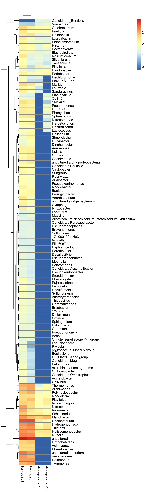

# Preprocessing

We start by specifiying the taxa rank at which to summarize:

```{r}
library(mbtools)

trank <- "genus"
```

Now we will read both phyloseq objects, summarize them and filter:

```{r}
illumina <- readRDS("illumina_phylo.rds")
nanopore <- readRDS("nanopore_phylo.rds")
tax_table(nanopore) <- tax_table(nanopore)[, c("kingdom", "class", "order", "phylum", "family", "genus", "species")]

counts <- list()
counts$illumina <- illumina %>% taxa_count(trank)
counts$illumina[, "assay" := "illumina"]

counts$nanopore <- nanopore %>% taxa_count(trank)
counts$nanopore[, "assay" := "nanopore"]

genera <- rbindlist(counts)
```

Lets visualize those:

```{r}
biofilter <- c("Aquaponics_10", "Aquaponics_28", "barcode01", "barcode05")

library(pheatmap)
mat <- dcast(genera, sample ~ taxa, value.var = "reads", fill = 0)
samples <- mat[, sample]
mat[, sample := NULL]
mat <- as.matrix(mat)
rownames(mat) <- samples
mat <- filter_counts(mat, presence = 0)
pheatmap(log10(t(mat) + 0.5), filename = "figures/genera.png", 
         width = 6, height = 20)

```

## Concordance by taxa level

Let's try to see how well the MinION and Illumina data correlates based on taxonomic rank.

```{r, warning = FALSE}
ranks <- rank_names(illumina)[1:6] %>% tolower()
counts <- lapply(ranks, function(r) {
    cn <- list()
    cn$illumina <- illumina %>% taxa_count(r)
    cn$illumina[, "assay" := "illumina"]
    cn$nanopore <- nanopore %>% taxa_count(r)
    cn$nanopore[, "assay" := "nanopore"]
    cn <- rbindlist(cn)[sample %chin% biofilter] %>% 
          dcast(taxa ~ sample, value.var = "reads", fill = 0)
    cn[, "rank" := r]
}) %>% rbindlist()
counts[, rank := factor(rank, levels = ranks)]
```

Let's sum up the repeat samples:

```{r}
counts[, "illumina" := Aquaponics_10 + Aquaponics_28]
counts[, "nanopore" := barcode01 + barcode05]
```

We can recheck whether we can catch nitrifiers:

```{r}
nitro <- melt(counts[grepl("Nitro", taxa), .(taxa, rank, illumina, nanopore)], 
              id.vars = c("taxa", "rank"), 
              value.name = "reads", variable.name = "sequencing")
nitro[, taxa := paste0(taxa, " (", rank, ")")]
ggplot(nitro, aes(x = reads + 0.5, y = taxa, color = sequencing)) + 
    geom_line(aes(group = taxa), color = "gray") +
    geom_point(stat = "identity") +
    scale_x_log10() + labs(x = "no. reads + 0.5", y = "")
ggsave("figures/nitrifiers.png", width = 6, height = 3, dpi = 300)
```

And finally lets plot the agreement over ranks:

```{r}
library(ggplot2)
theme_set(theme_minimal())

meds <- counts[illumina == 0, .(q25 = quantile(nanopore + 0.5, 0.25),
                                q75 = quantile(nanopore + 0.5, 0.75),
                                median = median(nanopore + 0.5)), by = rank]

ggplot(counts, aes(x = illumina + 0.5, y = nanopore + 0.5)) + 
    geom_boxplot(data = counts[illumina == 0], outlier.color = NA, color = "tomato", width = 0.6) +
    geom_point(stroke = 0)  +
    scale_x_log10() + scale_y_log10() +
    stat_smooth(method = "glm", data = counts[illumina > 0 & nanopore > 0]) +
    facet_wrap(~ rank) + 
    labs(x = "no. illumina reads + 0.5", y = "no. nanopore reads + 0.5")
ggsave("figures/ranks.png", width = 6, height = 4, dpi = 300)
```

And the corresponding R2 and p values:

```{r}
stats <- function(y, x) {
    mod <- lm(y ~ x)
    ano <- anova(mod)
    ssq <- ano[["Sum Sq"]]
    p <- ano[["Pr(>F)"]]
    rho <- cor(y, x, method = "spearman")
    return(list(R2 = ssq[1] / sum(ssq), pval = p[1], spearman = rho))
}
counts[nanopore > 0 & illumina > 0, 
       stats(log2(nanopore + 0.5), log2(illumina + 0.5)), by = rank]
```

And the correlations:

```{r}
corrs <- counts[, .(taxa, cor = cor(log10(illumina + 0.5), 
                                    log10(nanopore + 0.5))), by = rank]
corrs[, "observed in" := "any"]
corrs2 <- counts[illumina > 0 & nanopore > 0, 
                 .(taxa, cor = cor(log10(illumina + 0.5), log10(nanopore + 0.5))), 
                 by = rank]
corrs2[, "observed in" := "both"]
corrs <- rbind(corrs, corrs2)

ggplot(corrs, aes(x = rank, y = cor, color = `observed in`)) + 
    geom_point() + geom_line(aes(group = `observed in`)) + ylim(0, 1) +
    labs(x = "", y = "Pearson correlation [log-scale]")
ggsave("figures/correlations.png", width = 4, height = 3, dpi = 300)
```

We can see a large group of taxa that are present only in the Nanopore data. Those are the
ones we can not be sure about. They seem to be less abundant than the correctly classified
ones so let's have a closer look at their abundance distribution.

```{r}
ggplot(counts[illumina == 0], aes(x = nanopore)) + 
    geom_vline(xintercept = 300, linetype = "dashed", color = "tomato") +
    geom_histogram(bins = 20) +
    facet_wrap(~ rank) + scale_x_log10() +
    labs(x = "no. nanopore reads")
ggsave("figures/cutoff.png", width = 6, height = 4, dpi = 300)
```

The marked cutoff of 200 reads seems to reomove the majority of spurious taxa. Let's quantify what
proportion of spurious associations we can get rid off. As we can see we get rid of >95% of the spurious
assignments on the genus level.

```{r}
counts[illumina == 0, sum(nanopore < 300) / .N, by = rank]
```

And across all taxa:

```{r}
counts[illumina == 0, sum(nanopore < 300) / .N]
```